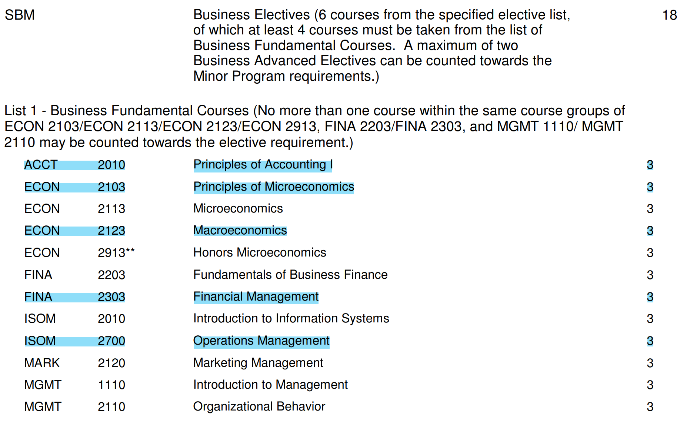
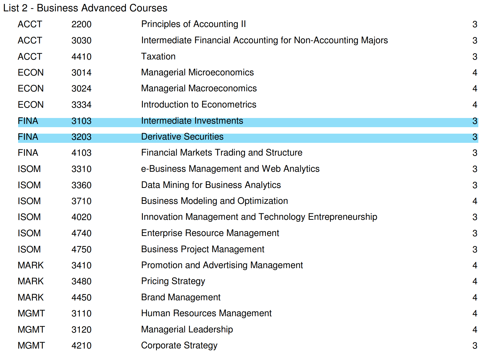

By Yiduo Yu

As you may know, during my four year university life at the Hong Kong University of Science and Technology as a computer science student, I also took a minor in the General Business. I made this choice in my second year at college because I am quite interested in the business world. 

But to be honest, this path is not easy to go since I encountered many problems with course registration, time planning, and etc. I found that there is no resource online about the Business Minor Experience and I have no seniors taking on this path as a student from non-business departments. So during all of the four years, I just explored the way on my own. Now it is my last semester in HKUST and fortunately I have finished the minor program successfully. I would like to share my experience and hopefully it will help somebody to better prepare for their curriculum. 

## Minor Requirements

To graduate with a minor in Business, you must complete a minimum total of 18 credits and all of its requirements, and attain an average grade point of at least 1.85 in courses taken within the minor program. You need to take 6 courses from the specified elective list, of which at least 4 courses must be taken from the list of **Business Fundamental Courses**. A maximum of two  **Business Advanced Electives** can be counted towards the Minor Program requirements. I have attached the two list below, the blue highlights indicates the courses that I took. You could also view the full file [here](/files/minor-bus.pdf).

One annoying thing is that you have to select different course titles from the fundamental list. For example, ECON 2103/ECON 2123 could not be double counted. The business department made this decision based on the motivation to let their minor students exposed to many study fields of the business world. But this might not be friendly for someone determined to study in one of the sub-areas in business, say, finance. But since HKUST only offers this general business minor choice in the Business School, there is nothing called minor in finance, so you have to take these into consideration and think twice when you decide whether to apply this program. 

But as you can see, I personally take both the ECON 2103 and ECON 2123 courses. I did this purely for personal interest. The requirement only mentions that it will only count one of the courses but it does not mean that you could not take other courses from the list with the same course title. So just feel free to enroll in any courses you are interested if you have time to do so. 

## Issues & Problems

One major problem with the minor in general business program, which is also the reason that make it stand out from all other minor programs, is the **reserved quota issue**. I know many other peers who take minor in math, in computer science, or electronic engineering, they could all get their course registered properly without problems. But the HKUST business school is quite exclusive I would say. Except for a tiny proportion of common core courses like ECON 2103 and ECON 2123, all other courses have their quotas reserved for Business school students. To be more specific, this means you could only get into the course if at the first day of the semester (when the reserved quotas are released), there are still some vacant places left or the waitlist is not so long. 

I am also quite unsatisfied with this policy cause it prevent us from getting into popular and good courses. So how can business minor students overcome this barrier? My advice is, when you find the course is popular and the place is tight, you'd better go and choose the 9:00 am section class. It is widely acknowledged that students in university tend to get up very late in the morning, and thus reluctant to choose a course scheduled at the first timeslots of the day. So you will have a better chance of getting in. As for me, my ECON2103, ACCT2010, ECON2123, FINA2303, FINA3203 are all 9:00 am classes. You have to get prepared for this cause if you are really interested in business and want to take the minor, getting up early may be the price you have to pay haha😂. 

## My minor path and the courses

I took the course *ECON 2103 Microeconomics* in year one Spring and develop my interest in minoring business. I would say it is not hard to learn and this course is really about the business fundamental and should be a good starting point if you would like to try. Additionally, this course is a common core course so you don't have to worry about the reserved quota issue and you could easily get in even without a business minor identity like me in year 1. 

Then I took the course *ACCT 2010 Principles of Accounting* where I learned some basic knowledge about the financial statement and how to analyze those numbers. This course has a high reputation cause every instructor are quite kind and helpful, and they won't be very harsh when it comes to grading. (At least it was the case two years earlier.)

What comes next is *ISOM 2700 Operation Management*. The content is what as the name suggests, but personally I don't think it's interesting, I merely use it to fulfill my basic list requirement. There were not much meaningful things to learn. See, this is the bad part about the minor requirements policy.

*ECON 2123 Macroeconomics* is the course really worth mentioning. The content is pretty good about the high-level economy. And the professor Zhang Wenwen is, I would say, the best teacher in the business school. You could see from my [Course Review](https://ust.space/review/ECON2123/view/rfEVMBWOXofEL6JipVXhnYwZYKkLWIuy) on USTSPACE for details. To state it briefly, Wenwen is serious and responsible for her work, and her teaching is pellucid and not limited by the notes. By the way, she also teaches the ECON 2103 course sometimes and you probably don't want to miss it. 

For *FINA 2303 Financial Management*, there's a short story.  This course is totally the same with *FINA 2203*, the only difference is that it take course *ISOM 2500* as a pre-requisite (which means you have to take that course first to enroll in 2303). But FINA 2203 has just one section every semester and it always conflicts with my major computer science courses. So I emailed Professor Ekkachai in year 2, clearly stated the reasons that made me choose *FINA2303*, but he refused to let me in the course without *ISOM 2500* taken. No offense here, my friends told me that he is a pretty good professor, but if you are minoring business and encountering the same situation like me, you might not want to find him for the request. (My request email is 500 words long or so, I really spent time writing it.) You either choose to ask another professor of *FINA 2303* to see whether he/she could let you in or schedule this course to the next semester. I chose the latter option and professor PI, Lynn said I could definitely take her course. She is very nice, at the end of that semester, I also talked to her to seek for some advice related to my business minor path. About the course content, it is just fundamental finance stuff, but I suggest every business minor student to take it. They are not that interesting, but fairly essential in the business world.

*FINA 3103 Intermediate Investments*. This course is about the Asset pricing model, CAPM, Fama French Model and other related stuff. I integrated my programming skills and finance skills together to do project in this course focused on *The Analysis of CAPM and Fama French Model Based On The US Stock Market Under Coronavirus*, and the final work could be seen [here](https://github.com/Yorkbenno/The-Analysis-of-the-US-Stock-Market-Under-Coronavirus). 

*FINA 3203 Derivative Securities*. This course is all about Derivative. The most challenging course I took for the whole minor business track. Derivative is a quite deep topic and bothers many students, but if you really get into it and understand how it works, they are also rewarding and charming.

## Final Conclusion

Anyone who is not from the business school but interested in the field are welcomed to take this minor. I admitted that the reserved quota and the requirements to pick courses from different titles bothered me a lot. But please don't be too worried. As I said, you could always get in if it is a 9:00 am class. And for some other cases, please just be patient, according to my experience, there are always at least a dozen students drop (10+) for each business course during the add and drop period. More importantly, always plan early on which course, at which semester you will study bcause some courses are not open every semester and there might be some time conflicts with your major courses.

I wish you good luck when taking this minor in Genereal Business program!

