By Yiduo Yu

*Deep Residual Learning for Image Recognition* [1], one of the most cited works in computer science by He Kaiming, pushed deep learning technologies into a new era. Although more than six years have passed, it is still worthwhile to peek into this paper, and then understand how the later works made improvements on it.

Personally, I don't think Resnet is as simple as it might be thought of. At least for me myself, when I first look into the Resnet code, I have no idea why it has basic block and bottleneck block, why it keeps scaling down and up in the feature dimensions. Well, that's something you will never get if you never look at this paper thoroughly. Here I will give a quick overview of this paper and some highlights of it.

## Deep Residual Learning for Image Recognition [1]

>  What problem this paper solved that makes it so popular and impressed the whole practitioners? 

For this question, every deep learning guy could quickly shout out that the Resnet solved the problem that we cannot make a model extremely deep. Previous plain models could only get to about 20+ layers. But there's always a common mistake in that people always think we cannot go that deep because of the vanishing/exploding gradients problem. But as mentioned in the paper, this problem is addressed mainly by normalized initialization and intermediate normalization layers (batchnorm), so the gradient between layers actually appears to be relatively healthy.

So the main issue here that we could not go that deep is the difficulty of optimizing large networks. So the illustration of the below image, it is pretty hard to optimize the 56-layer one. It is not caused by over-fitting since the training error also significantly increased. And this issue cannot be tackled by simply increasing the training epochs shown by the experiment. But the paper does not explain this phenomenon (I am not sure whether this problem has already been solved or not).

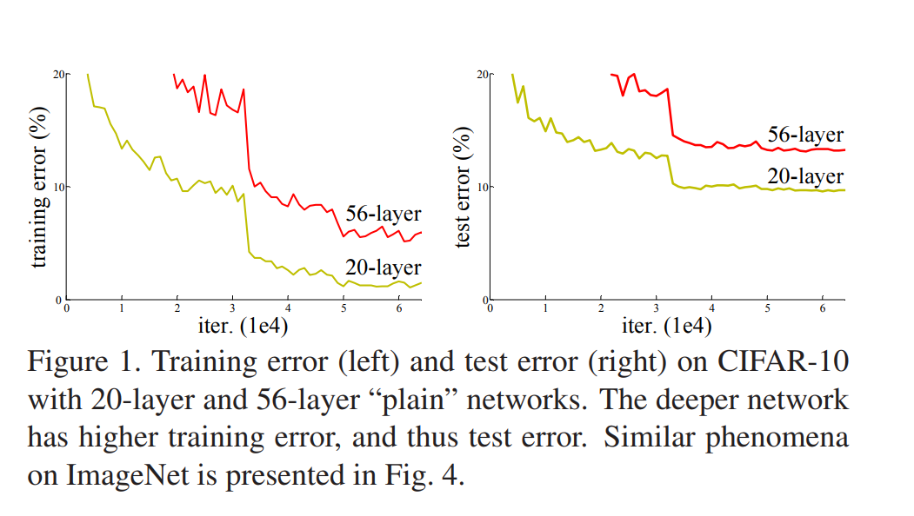

So they propose a famous skip connection block that turn the learning problem from learning a function `H(x)` into learning the residual function `F(x)`. In this case, `H(x)` = `F(x)` + `x`. 

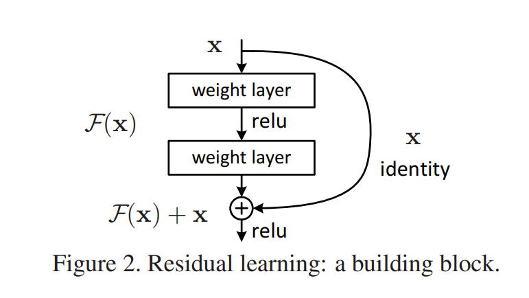

So what's the benefit of putting it in this way?

> They hypothesize that it is easier to optimize the residual mapping than to optimize the original, unreferenced mapping. To the extreme, if an identity mapping were optimal, it would be easier to push the residual to zero than to fit an identity mapping by a stack of nonlinear layers.

Yeah, the original unreferenced CNN might be hard to fit the identity mapping function. And we can see from the below image that in later layers of the Resnet family, the responses are pretty low, suggesting that identity mappings provide reasonable preconditioning. 

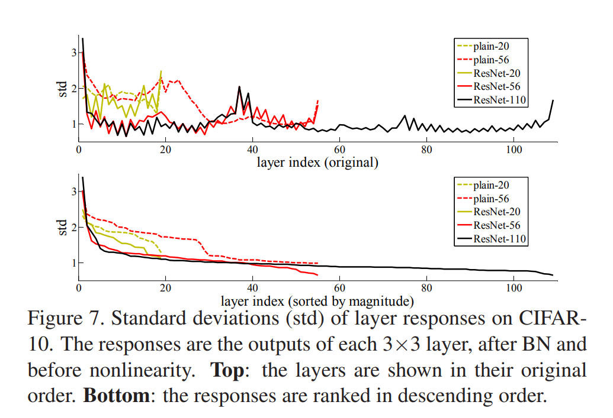

Figure 7
 

Except for the building blocks, the identity mapping is constructed by simply adding the values element-wise. If the size or dimension changes, then the identity mapping part will go through a 1x1 convolution layer to project features into the desired space. 

### Build deeper networks

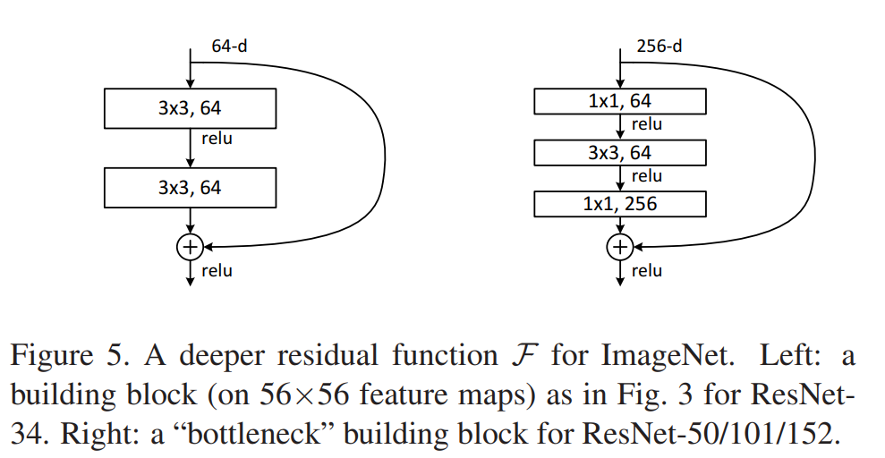

Starting from Resnet50, they modify the basic block into a bottleneck block. The main difference is that the basic block consists of two 3x3 convolution layers, while the bottleneck layer has three Conv layers with different kernel sizes. The main reason for using bottleneck designs is due to **practical considerations** since by leaving the 3×3 layer a bottleneck with smaller input/output dimensions, the computational demand could be greatly reduced. This gives a proper explanation of why Resnet keeps scaling up and down in feature dimensions. 

### Other findings

By extensive experiments they carried out, they also have some other explorations: 

- They showed that the Resnet could facilitate training by providing faster convergence at the early stage.
- The 1202-layer network may be unnecessarily large (19.4M) for this small dataset and still can engaged in the over-fitting problem. Since in this case it has similar training error compared to the 110 layers Resnet but carried a larger test error.

*But is there any problems with the initial Resnet?* 

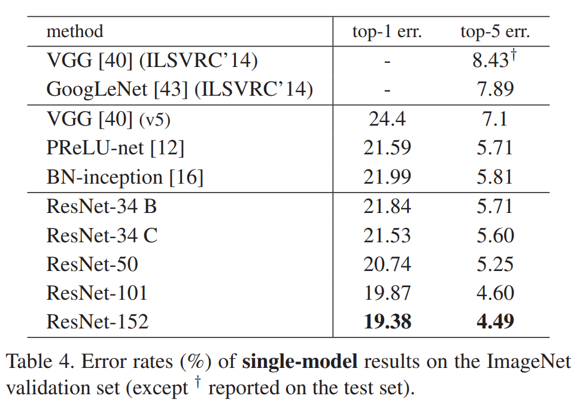

From the table above, we can clearly see that the accuracy also saturates when the Resnet goes deeper and deeper. Specifically, from Resnet101 to Resnet152, the top-1 error and top-5 error of ImageNet only improves 0.49% and 0.11% respectively. This is reasonable by referring to the previous [Figure 7](#f7), as we can see that the deeper layers have low responses, indicating that they only made some small modifications. 

So it might be not that surprising when Andreas Veit observe that removing single layers from residual networks at test time does not noticeably affect their performance [2]. They think the residual networks can be seen as collections of many paths and the only effective paths are relatively shallow, so the problem to optimize very deep networks are still yet to be solved.

## Residual Networks Behave Like Ensembles of Relatively Shallow Networks [2]

By taking a closer look at the residual network, we unravel it and see it actually consists of many sub-paths. 

Here the picture shows a three-block residual network. In the classical visual hierarchy, each layer depends only on the previous layer's output. But for the residual network, each module `fi` in the network is fed data from a mixture of 2^(i−1) different distributions generated from every possible configuration of the previous i − 1 residual module. So they carried out many experiments to further dig into the structure.

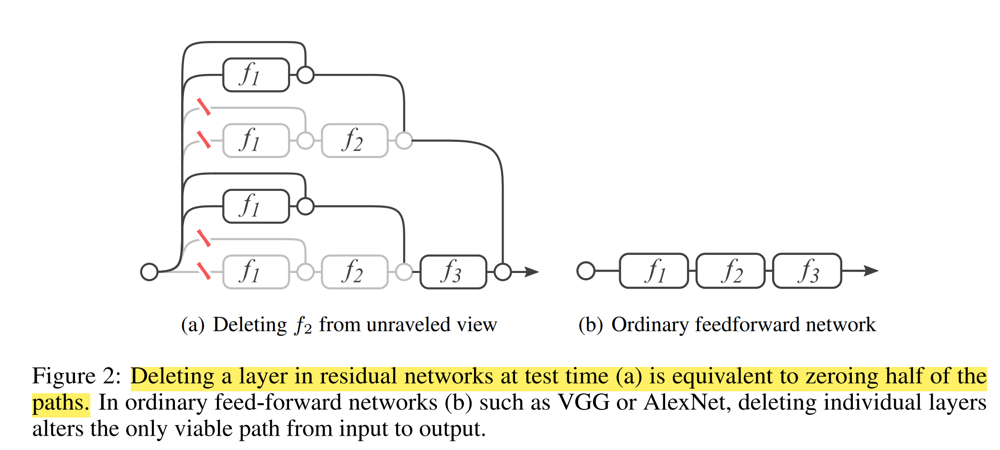

###  Experiment: Deleting individual layers from neural networks at test tim

They remove the residual module from a single building block, leaving the skip connection untouched. That is, they change `yi` = `yi−1` + `fi(yi−1)` to `yi` = `yi−1`. 

The result shows that removing downsampling blocks does have a modest impact on performance, but no other block removal leads to a noticeable change. The paper proposed that by dropping only one layer, the model still has half of the layers valid, which helps to keep the performance. They then suggest that paths in a residual network do not strongly depend on each other although they are trained jointly. 

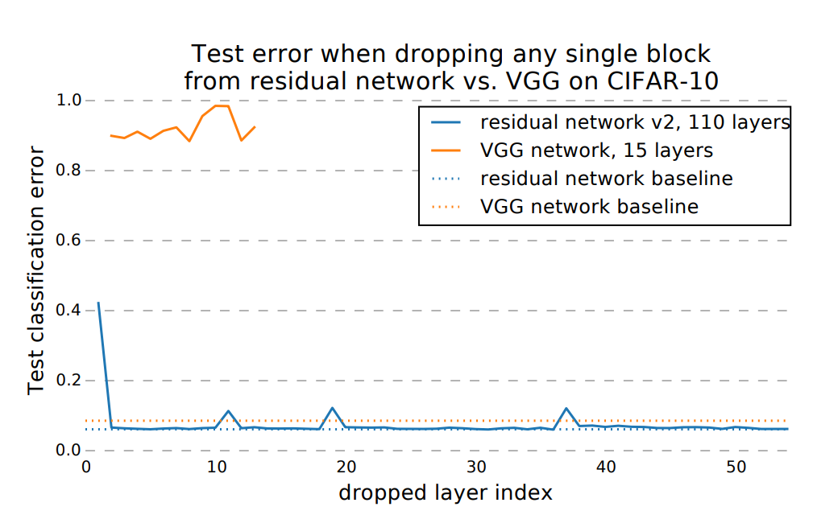

But for this part, I could only partially agree with them. This result seems quite reasonable, for the downsampling part, cause we are actually changing the dimension and sizes of feature maps, they tend not to be barely an identity mapping. Thus, our learned transformation `H(x)` = `F(x)` + `x` should have a more complicated `F(x)` to diffuse, integrate the features or focus on more general patterns rather than keep in low responses. Thus dropping this layer will create some kind of the increase in error. But for other layers, we could see from the last paper that it is indeed just doing some minor modifications without deviating too much  from identity mapping, so a low error increase is just as expected since we did not remove the skip connection part. 

The paper indicates: *by dropping only one layer, the model still have half of the layers valid, which helps to keep the performance*, this sentence is not convincing to me, they need to show by removing the skip connections, in which case the model also have its valid paths halved, and I expected that the test error will surge then. 

### Experiment: Deleting many modules from residual networks at test-time

One key characteristic of ensembles is that their performance depends smoothly on the number of members. If the collection of paths were to behave like an ensemble, we would expect test-time performance of residual networks to smoothly correlate with the number of valid paths.

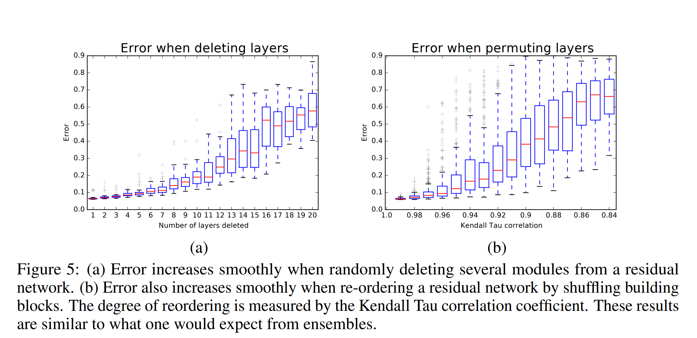

So they show by experiment that the Resnet indeed behaves somewhat like a ensemble of `2^n` networks.

### Experiment: Path length and gradient

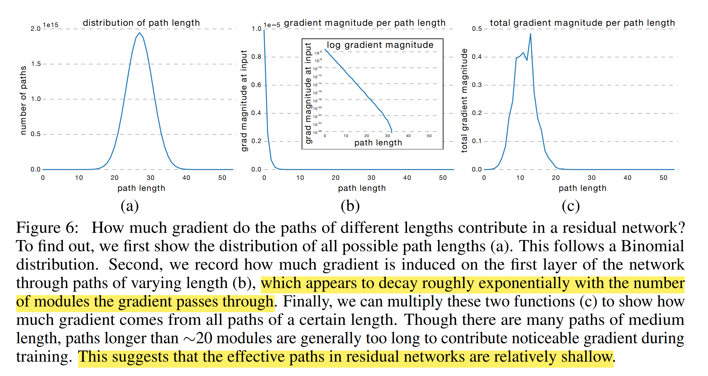

We know that the number of paths of different lengths follows a binomial distribution. And they sample individual paths of a certain length and measure the norm of the gradient that arrives at the input. To sample a path of length k, they first feed a batch forward through the whole network. During the backward pass, they randomly sample k residual blocks. For those k blocks, they only propagate through the residual module; for the remaining n − k blocks, they only propagate through the skip connection. Thus, they only measure gradients that flow through the single path of length k. The results show that the gradient magnitude of a path decreases exponentially with the number of modules it went through in the backward pass.

So multiply them and they get Figure 6 (c). Surprisingly, almost all of the gradient updates during training come from paths between 5 and 17 modules long. These are the **effective paths** and they are relatively shallow compared to the total length of network.

> "To validate this result, we retrain a residual network from scratch that only sees the effective paths during training. This ensures that no long path is ever used. If the retrained model is able to perform competitively compared to training the full network, we know that long paths in residual networks are not needed during training. We achieve this by only training a subset of the modules during each mini batch. In particular, we choose the number of modules such that the distribution of paths during training aligns with the distribution of the effective paths in the whole network. For the network with 54 modules, this means we sample exactly 23 modules during each training batch. Then, the path lengths during training are centered around 11.5 modules, well aligned with the effective paths. In our experiment, the network trained only with the effective paths achieves a 5.96% error rate, whereas the full model achieves a 6.10% error rate. There is no statistically significant difference. This demonstrates that indeed only the effective paths are needed."

So initially, He kaiming proposed that Resnet gives a better result because it could go deeper in network structures. But this paper, suggests that the network, although seems quite deep, is actually an ensemble of many smaller networks and much shallower than the previously thought one.

But just as the author said, this work just *presents a complementary explanation* to Resnet and is not a counterargument to it. From my point of view, it shows that by constructing a pool of smaller ensemble networks in this way, we could greatly facilitate the training procedures and help the network to optimize while admitting that the *effective path* is indeed not as expected.

## Wider or Deeper: Revisiting the ResNet Model for Visual Recognition [3]

As the name suggests, the paper is interested in whether deep, or wide, is the right strategy for constructing networks. It first pointed out that the residual network does not actually performs the exponential ensemble of sub-networks.

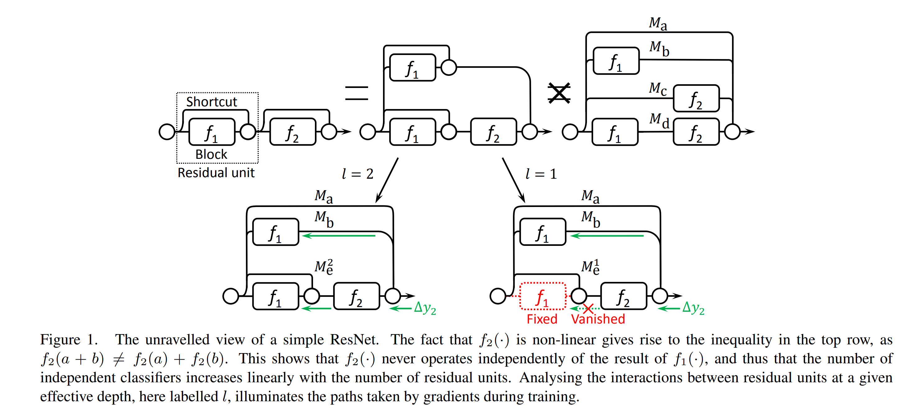

Figure 1
 

As illustrated in Figure 1, since the residual units are nonlinear, we cannot further split the bottom path into two subnetworks, i.e., Mc and Md. It turns out that ResNets are only assembling linearly growing numbers of sub-networks.

Then they introduce the concept of effective path, if the effective path `l` is 1, then in the above image, the bottom right is what actually happens, the `Me1` only has one path and the `f1` there is fixed and not learned. 

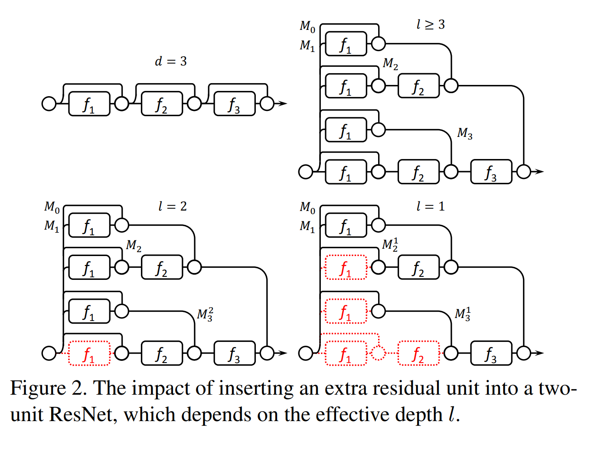

Following this idea, when viewing a residual network with `d`=3, when `d`≤ `l`. At the beginning, the shallowest subnetwork, i.e., `M1`, converges fast, because it gives Block 1 the largest gradients. From the point of view of `M2`, Block 2 may also receive large gradients due to the path with a length of one. However, the input of Block 2 partly depends on Block 1. So Block 2 always converge after the output of Block 1 stabilizes. And so on. In this way, their hypothesis is proved by another work down by  Littwin and Wolf indicating that ResNets are virtual ensembles whose depth grows as training progresses [4].

But the story is different when `d`>= `l`. See the bottom right example when `l `=1. Again, Block 1 in `M1` gets trained and stabilises first. However, this time `M21` is not fully end-to-end trained any more. Since `M21` gives no gradients to Block 1, it becomes a one-block sub-network trained on top of some prepossessed representations, which are obtained by adding the output of Block 1 up to the original input. In this way, the newly added sub-network `M21` still has an actual depth of one, which is no deeper than the previous one, i.e., `M1`, and so forth for `M31`. So some might think that ResNet avoid the vanishing gradient problem by reshaping themselves into multiple shallower sub-networks.

> So what's the benefits for a network to go wider?

If we have a network `d`≤ `l`, then it behaves like the top right figure. We reuse the weights of Block 1 for four times. Among these, Block 1 is located in three different kinds of circumstances. In the bottom-most path of the sub-network `M3`, it is supposed to learn some low-level features; in `M2`, it should learn both low-level and mid-level features; and in `M1`, it has to learn everything. This format of weight sharing may suppress over-fitting, especially for those units far from the top-most linear classifier. Hence ResNets inherently introduce regularization by weight sharing among multiple very different sub-networks.

From their point, going deep, we will actually get a wider network, with extra features which are not completely end-to-end trained; going wider, we will literally get a wider network, without changing its end-to-end characteristic.

So they choose to go wider instead of going deeper. Based on the work down by Zagoruyko and Komodakis[5], they choose the residual building block to be a stack of two 3 × 3 convolution stages.

The proposed architecture is like below:

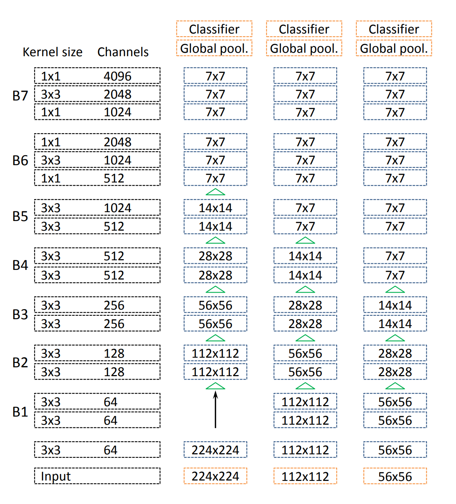

Note that they adopted the bottleneck structure as in [1] for B6 and B7, but they did not give any explanations why they do this. (I suppose like in the Resnet[1], they adopt this simply because they want to reduce the computational demand when the feature maps are high in dimensions.)

For the segmentation tasks, they set the stride in the first block of B5 to 1 so that it will not downsample the feature map sizes. They then increase the dilation rate from one to two for the following layers and do the same thing to the first convolution layer in B6 too, and increase the dilation rate from two to four for the following layers.

### Experiment

The experiment part in this paper is not complicated. They carried out their model and compared it with Resnet in different tasks. They show that their model could outperform very deep networks like Resnet101 and Resnet152 in classification and segmentation. The improvement is around 1% for classification tasks, but for segmentation tasks, they lift the mIoU about 3% to 5%, which is a considerable improvement. 

All in all, these results show that the proposed architecture delivers better feature extraction performance than the current state-of-the-art. Since the segmentation improvements are pretty significant, so usually in weakly supervised semantic segmentation or other common segmentation tasks, we just adopt the proposed wide Resnet38 instead of the initial Resnet.

[1] He, K., Zhang, X., Ren, S., & Sun, J. (2016). Deep residual learning for image recognition. In *Proceedings of the IEEE conference on computer vision and pattern recognition* (pp. 770-778).

[2] Veit, A., Wilber, M. J., & Belongie, S. (2016). Residual networks behave like ensembles of relatively shallow networks. *Advances in neural information processing systems*, *29*.

[3] Wu, Z., Shen, C., & Van Den Hengel, A. (2019). Wider or deeper: Revisiting the resnet model for visual recognition. *Pattern Recognition*, *90*, 119-133.

[4] Littwin, E., & Wolf, L. (2016). The loss surface of residual networks: Ensembles and the role of batch normalization. *arXiv preprint arXiv:1611.02525*.

[5] Zagoruyko, S., & Komodakis, N. (2016). Wide residual networks. *arXiv preprint arXiv:1605.07146*.

